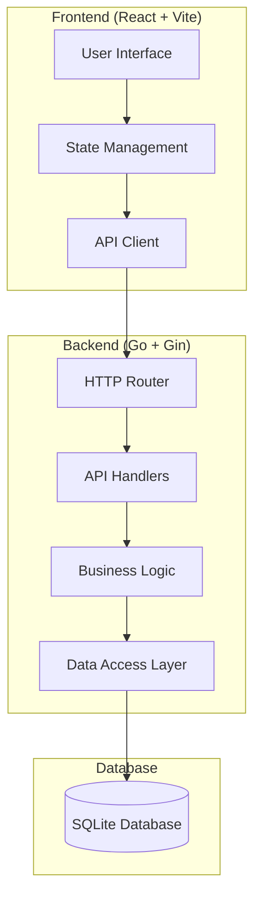

# Design Document

## Overview

The Task and Calendar Manager is a full-stack web application that provides integrated task management and calendar functionality. The system follows a clean architecture pattern with clear separation between the Go backend API, SQLite database, and React frontend. The application emphasizes responsive design, real-time data synchronization, and intuitive user experience.

## Architecture

### System Architecture



### Technology Stack

- **Frontend**: React 19, TypeScript, Vite, Tailwind CSS
- **Backend**: Go 1.25, Gin framework, SQLite driver
- **Database**: SQLite 3
- **Development**: Hot reload, ESLint, TypeScript compilation

## Components and Interfaces

### Backend Components

#### 1. Database Models

**Task Model**
```go
type Task struct {
    ID          int       `json:"id" db:"id"`
    Title       string    `json:"title" db:"title"`
    Description string    `json:"description" db:"description"`
    DueDate     *time.Time `json:"due_date" db:"due_date"`
    Status      string    `json:"status" db:"status"` // "pending", "completed"
    CreatedAt   time.Time `json:"created_at" db:"created_at"`
    UpdatedAt   time.Time `json:"updated_at" db:"updated_at"`
}
```

**Event Model**
```go
type Event struct {
    ID          int       `json:"id" db:"id"`
    Title       string    `json:"title" db:"title"`
    Description string    `json:"description" db:"description"`
    StartTime   time.Time `json:"start_time" db:"start_time"`
    EndTime     time.Time `json:"end_time" db:"end_time"`
    CreatedAt   time.Time `json:"created_at" db:"created_at"`
    UpdatedAt   time.Time `json:"updated_at" db:"updated_at"`
}
```

#### 2. API Endpoints

**Task Endpoints**
- `GET /api/tasks` - List all tasks with optional filtering
- `POST /api/tasks` - Create a new task
- `GET /api/tasks/:id` - Get specific task
- `PUT /api/tasks/:id` - Update task
- `DELETE /api/tasks/:id` - Delete task

**Event Endpoints**
- `GET /api/events` - List events with date range filtering
- `POST /api/events` - Create a new event
- `GET /api/events/:id` - Get specific event
- `PUT /api/events/:id` - Update event
- `DELETE /api/events/:id` - Delete event

**Dashboard Endpoint**
- `GET /api/dashboard` - Get combined tasks and events for dashboard view

#### 3. Service Layer

**TaskService**
- Handles business logic for task operations
- Validates task data and business rules
- Manages task status transitions

**EventService**
- Manages calendar event operations
- Handles date/time validation and conflicts
- Provides date range queries

**DashboardService**
- Aggregates data from tasks and events
- Provides unified view for dashboard
- Handles cross-entity filtering

#### 4. Repository Layer

**TaskRepository**
- CRUD operations for tasks
- Query methods for filtering and searching
- Database transaction management

**EventRepository**
- CRUD operations for events
- Date range queries
- Calendar-specific data retrieval

### Frontend Components

#### 1. Core Components

**App Component**
- Main application container
- Routing and navigation management
- Global state initialization

**Layout Components**
- Header with navigation
- Sidebar for quick actions
- Main content area

#### 2. Task Management Components

**TaskList**
- Displays paginated list of tasks
- Filtering and sorting capabilities
- Quick status toggle actions

**TaskForm**
- Create/edit task modal or page
- Form validation and submission
- Date picker integration

**TaskCard**
- Individual task display component
- Status indicators and actions
- Due date highlighting

#### 3. Calendar Components

**CalendarView**
- Monthly calendar grid display
- Event indicators on dates
- Navigation between months

**EventForm**
- Create/edit event modal
- Date/time pickers
- Validation for time conflicts

**EventDetails**
- Event information display
- Edit and delete actions
- Time formatting

#### 4. Dashboard Components

**Dashboard**
- Combined view of tasks and events
- Quick stats and summaries
- Recent activity feed

**UpcomingItems**
- List of upcoming tasks and events
- Priority-based sorting
- Quick action buttons

## Data Models

### Database Schema

```sql
-- Tasks table
CREATE TABLE tasks (
    id INTEGER PRIMARY KEY AUTOINCREMENT,
    title TEXT NOT NULL,
    description TEXT,
    due_date DATETIME,
    status TEXT NOT NULL DEFAULT 'pending',
    created_at DATETIME DEFAULT CURRENT_TIMESTAMP,
    updated_at DATETIME DEFAULT CURRENT_TIMESTAMP
);

-- Events table
CREATE TABLE events (
    id INTEGER PRIMARY KEY AUTOINCREMENT,
    title TEXT NOT NULL,
    description TEXT,
    start_time DATETIME NOT NULL,
    end_time DATETIME NOT NULL,
    created_at DATETIME DEFAULT CURRENT_TIMESTAMP,
    updated_at DATETIME DEFAULT CURRENT_TIMESTAMP
);

-- Indexes for performance
CREATE INDEX idx_tasks_due_date ON tasks(due_date);
CREATE INDEX idx_tasks_status ON tasks(status);
CREATE INDEX idx_events_start_time ON events(start_time);
CREATE INDEX idx_events_date_range ON events(start_time, end_time);
```

### Frontend State Management

**Task State**
```typescript
interface TaskState {
  tasks: Task[];
  loading: boolean;
  error: string | null;
  filters: TaskFilters;
}
```

**Calendar State**
```typescript
interface CalendarState {
  events: Event[];
  currentMonth: Date;
  selectedDate: Date | null;
  loading: boolean;
  error: string | null;
}
```

**Dashboard State**
```typescript
interface DashboardState {
  upcomingTasks: Task[];
  upcomingEvents: Event[];
  stats: DashboardStats;
  loading: boolean;
}
```

## Error Handling

### Backend Error Handling

1. **Validation Errors**: Return 400 Bad Request with detailed field errors
2. **Not Found Errors**: Return 404 with resource-specific messages
3. **Database Errors**: Return 500 with generic error message, log details
4. **Concurrent Modification**: Return 409 Conflict for version mismatches

### Frontend Error Handling

1. **Network Errors**: Display retry mechanisms and offline indicators
2. **Validation Errors**: Show field-level error messages
3. **Server Errors**: Display user-friendly error messages
4. **Loading States**: Provide visual feedback during operations

### Error Response Format

```json
{
  "error": {
    "code": "VALIDATION_ERROR",
    "message": "Invalid input data",
    "details": {
      "title": "Title is required",
      "due_date": "Due date must be in the future"
    }
  }
}
```

## Testing Strategy

### Backend Testing

1. **Unit Tests**
   - Service layer business logic
   - Repository CRUD operations
   - Validation functions
   - Error handling scenarios

2. **Integration Tests**
   - API endpoint functionality
   - Database operations
   - End-to-end request/response cycles

3. **Test Database**
   - In-memory SQLite for fast test execution
   - Test data fixtures and cleanup

### Frontend Testing

1. **Component Tests**
   - Individual component rendering
   - User interaction handling
   - Props and state management

2. **Integration Tests**
   - API integration
   - Form submission flows
   - Navigation and routing

3. **E2E Tests**
   - Critical user journeys
   - Cross-browser compatibility
   - Mobile responsiveness

### Testing Tools

- **Backend**: Go testing package, testify for assertions
- **Frontend**: React Testing Library, Jest, Cypress for E2E
- **API Testing**: Postman/Newman for API contract testing

## Performance Considerations

### Backend Optimization

1. **Database Indexing**: Proper indexes on frequently queried columns
2. **Query Optimization**: Efficient SQL queries with appropriate joins
3. **Caching**: In-memory caching for frequently accessed data
4. **Pagination**: Limit result sets for large data collections

### Frontend Optimization

1. **Code Splitting**: Lazy loading of route components
2. **State Management**: Efficient state updates and re-renders
3. **API Optimization**: Request batching and caching
4. **Bundle Optimization**: Tree shaking and minification

### Responsive Design

1. **Mobile-First**: Design for mobile devices first
2. **Breakpoints**: Tailwind CSS responsive utilities
3. **Touch Interactions**: Appropriate touch targets and gestures
4. **Performance**: Optimized images and minimal JavaScript